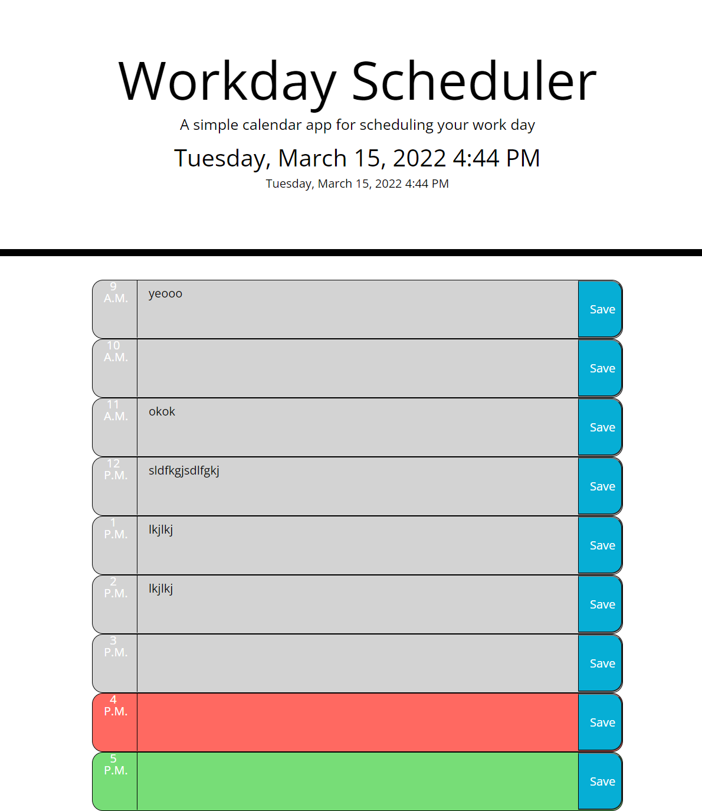

# DayPlanner

## Objective
The purpose of this project is to have a day planner that is color coded based on the time, and can add text from the user to local storage.

## Screenshot

 

## Link to Final Page
[Day Planner link to final page](https://boldsja.github.io/day-planner/) 

[Github Repo](https://github.com/boldsja/day-planner)
